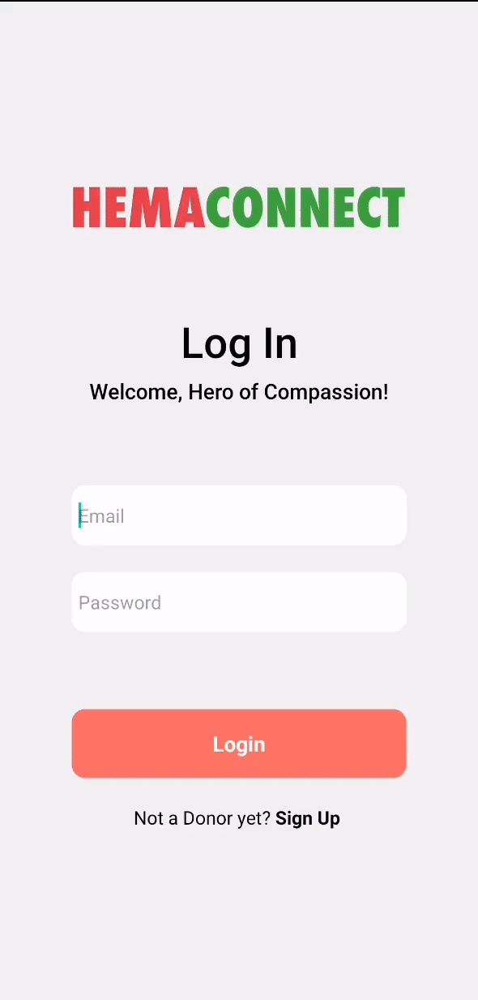

> Hello world! Welcome to my project, where I've transformed lines of code into a web application.
> 
**[PROJECT PHILOSOPHY](https://github.com/Cheaito-Hadi/HemaConnect#project-philosophy) • [MOCKUPS](https://github.com/Cheaito-Hadi/HemaConnect#mockups) • [TECH STACK](https://github.com/Cheaito-Hadi/HemaConnect#stacks) • [IMPLEMENTATION](https://github.com/Cheaito-Hadi/HemaConnect#implementation) • [HOW TO RUN?](https://github.com/Cheaito-Hadi/HemaConnect#installation)**
<br><br>

<!-- project philosophy -->


> HemaConnect is a web application which aims to create a platform to facilitate the process of blood donations.
>
> HemaConnect serves as the vital link connecting healthcare facilities with compassionate individuals eager to donate blood and make a life-saving difference. With its innovative approach, HemaConnect is poised to transform the blood donation process.

<span style="font-size: 20px;">Blood Donor Stories</span>
- As a blood donor, I want to see hospital blood requests, so I can know which hospital needs blood.
- As a blood donor, I want to book and see upcoming appointments, so I can manage my timings.
- As a blood donor, I want to view hospitals in need of blood on a map, so I can find the best route to reach it.

<span style="font-size: 20px;">Hospital Employee Stories</span>
- As an employee, I want to view and edit my blood banks, so I can be able to track my needs.
- As an employee, I want to create a request for blood, so I can show donors that we are in need of blood.
- As an employee, I want to view the donors' bookings, so I can keep track of the schedules.

<span style="font-size: 20px;">Admin Stories</span>
- As an admin, I want to view the hospitals, so I can add hospitals and employees.


<br><br>

<!-- Prototyping -->


> The design was planned from scratch on a paper then enhanced on Figma by adding details.

<span style="font-size: 22px;">Mockups</span>

<span style="font-size: 20px;">Log In</span>

| Login screen                                          |
|-------------------------------------------------------|
|  |

### Admin Screens (Web)
| Hospital Table                                               | Hospital Modal                                                        | Employee Modal                                                        |
|--------------------------------------------------------------|-----------------------------------------------------------------------|-----------------------------------------------------------------------|
|  |  |  |
### Hospital Employee Screens (Web)
| Blood Bank                                                       | Booking Table                                                     |
|------------------------------------------------------------------|-------------------------------------------------------------------|
|  |  |

| Request Modal                                                          | Donation Modal                                                          |
|------------------------------------------------------------------------|-------------------------------------------------------------------------|
|  |  |
### Blood Donor Screens (Mobile)
| OnBoarding                                                | OnBoarding                                       | OnBoarding                                            |
|-----------------------------------------------------------| --------------------------------------------------------- |-----------------------------------------------------------|
|  |  |       |

| Login screen                                   | Register screen                                      | Home screen                                  | 
|------------------------------------------------|------------------------------------------------------|----------------------------------------------|
|  |  |  | 

| Appointments                                                 | Map                                        | Profile                                            |
|--------------------------------------------------------------|--------------------------------------------|----------------------------------------------------|
|  |  |  |

<br><br>

<!-- Tech stack -->


###  HemaConnect is built using the following technologies:

- [React Native Expo](https://expo.dev/):  Expo is a set of tools and services built around React Native, making it easier to develop, test, and deploy mobile apps.
- [MySQL](https://www.mysql.com/): MySQL is a widely used open-source relational database management system (RDBMS). It is used as the database for storing and managing data.
- [React](https://react.dev/): React is a popular JavaScript library for building user interfaces. React utilized the development of web-based interfaces for employees and the administrator.
- [Laravel](https://laravel.com/): Laravel is a PHP web application framework known for its elegant syntax and developer-friendly features. It provides tools for routing, authentication, database interactions, and more. 
- [Firebase](https://firebase.google.com/) which is a set of backend cloud computing services and application development platforms provided by Google. I used it to send notifications for users.
- [React Native Maps](https://www.npmjs.com/package/react-native-maps): React Native Maps is a component system for maps that allows the integration with maps and location-based functionality in React Native mobile applications. I've also used [Google Geolocation and Services Integration](https://developers.google.com/maps); Google Geolocation and Services provide powerful geolocation and mapping capabilities. I've also used [Leaflet](https://leafletjs.com/) which is an open-source JavaScript library
  for mobile-friendly interactive maps.


<br><br>

<!-- Implementation -->


> Using the above mockups and technologies, HemaConnect introduce the following features:

### Blood Donor Screens (Mobile)
| OnBoarding                                       | Login screen                            | Register screen                          | Home screen                                        |
|--------------------------------------------------|-----------------------------------------|------------------------------------------|----------------------------------------------------|
|    |  |  |                  |
| Appointment screen                               | Map Screen                              | Profile Screen                           | Notification                                       |
|  |         |  |  |

### Login Screens (Web)
| Login screen                                         |
|------------------------------------------------------|
|  |


### Admin Screens (Web)
| Adding Employee                                           | Adding Hospital                                           |
|-----------------------------------------------------------|-----------------------------------------------------------|
|  |  |


### Hospital Employee Screens (Web)
| Blood Bank Page                                         | Booking Page                                                  |
|---------------------------------------------------------|---------------------------------------------------------------|
|  |  |


<br><br>

<!-- How to run -->


> To set up HemaConnect locally, follow these steps:

### Postman

This is a JSON file for the postman APIs collection for this project [HemaConnect.postman_collection.json](readme%2FHemaConnect.postman_collection.json) and it is hosted on the IP Address "52.210.183.13". You can change the address of the APIs to test them online with postman. 

### Prerequisites

This is a list of the dependencies you need to install on your OS to run HemaConnect.
* npm
  ```sh
   npm install npm@latest -g
  ```

### Installation

_Below is an example of how you can instruct your audience on installing and setting up your app. This template doesn't rely on any external dependencies or services._

1. Buy a [Google API Key](https://developers.google.com/maps) to run the map and addresses.
2. Clone the repo
   ```sh
   git clone https://github.com/Cheaito-Hadi/HemaConnect.git
   ```
~~ Frontend:
1. Navigate to the Frontend folder
   ```sh
   cd HemaConnect-client/
   ```
2. Install NPM packages
   ```sh
   npm install
   ```
3. Run Client 
   ```sh
   npm start
   ```
   
🚨 you might need to run `npm install --force`  if you face any dependency conflicts.

~~ Mobile:
1. Navigate to the Mobile folder
   ```sh
   cd HemaConnect-Mobile/
   ```
2. Install NPM packages
   ```sh
   npm install
   ```   
3. Install Expo Go app for Android (Optional)
   > [Android Play Store](https://play.google.com/store/apps/details?id=host.exp.exponent)

   > [Apple Store](https://apps.apple.com/us/app/expo-go/id982107779)
4. Run the Start-Up Command
   ```sh
   npx expo start -c
   ```

~~ Backend:
1. Navigate to the Backend folder
   ```sh
   cd HemaConnect-Server/
   ```
2. Rename `.env.example` to `.env` then set your credentials.
3. Database initialization 
   ```sh
   php artisan migrate
   ``` 
4. Run Client Server locally
   ```sh
   php artisan serve
   ``` 
5. In command prompt, run the below command to get the IPv4 Address
   ```sh
   ipconfig
   ```
6. Run the below command in the HemaConnect-Server
   ```sh
   php artisan serve --host "YOUR IPv4 ADDRESS"
   ```               

Now, you should be able to run HemaConnect locally and explore its features.